<p align="center">
  
</p>

<p align="center">
  <b>Análisis de impacto (BIA), plan de continuidad (BCP) y recuperación ante desastres (DRP) en un solo fichero HTML, sin servidor. Calcula si cada función vuelve a tiempo.</b>
</p>

<p align="center">
  <a href="https://heindall92.github.io/kairos/dist/index.html"></a>
</p>

<p align="center">
  <a href="https://github.com/heindall92/kairos/actions/workflows/tests.yml"></a>
  <a href="LICENSE"></a>
  
  
  
  
  
</p>

<p align="center">
  <picture>
    <source media="(prefers-color-scheme: dark)" srcset="docs/assets/readme/cifras-dark.svg">
    
  </picture>
</p>

<p align="center">
  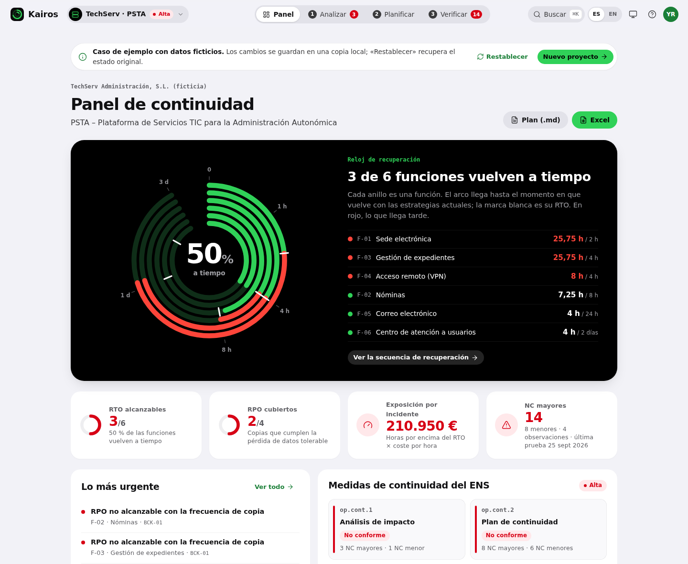
</p>

Una plantilla de BIA y BCP recoge datos: funciones, RTO, RPO, MTPD, activos, copias, equipo de crisis. Lo que no hace es comprobar si encajan entre sí. Un RTO de 2 horas es papel mojado si la función depende de un gestor documental que se restaura en frío en 24 horas. Una copia diaria no da un RPO de una hora. Y un plan que se activa a las 4 horas llega tarde para una función que tenía que volver a las 2.

**KAIROS hace esas cuentas.**
- **Cuándo vuelve cada función.** Recorre la cadena de dependencias: activos TIC, otras funciones y proveedores.
- **Si las copias cumplen el RPO.** Compara la pérdida de datos tolerable con la frecuencia real de las copias.
- **Cuánto cuesta no llegar.** Calcula la exposición económica de cada incidente.
- **Qué falta antes de la auditoría.** Revisa el plan con 29 reglas de ISO 22301, ISO/IEC 27001 y del ENS.

Καιρός es, en griego, el momento oportuno: no cuánto tiempo pasa, sino si llegas a tiempo.

Es un único fichero HTML. Funciona sin conexión, no tiene servidor y no hace ninguna petición de red.

<div align="center">

## `$ cat kairos.yaml`

<table>
  <thead>
    <tr>
      <th colspan="2" align="left"><code>kairos:~$ cat kairos.yaml</code></th>
    </tr>
  </thead>
  <tbody>
    <tr>
      <td width="50%" valign="top"><code>├─ normativa:</code><br><br>
        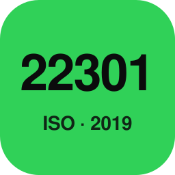
        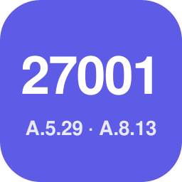
        
        <br>
        <sub><code>ISO 22301 § 8 · ISO/IEC 27001 A.5.29–A.5.30, A.8.13 · ENS op.cont.1–4, mp.info.6</code></sub>
      </td>
      <td width="50%" valign="top"><code>├─ motor:</code><br><br>
        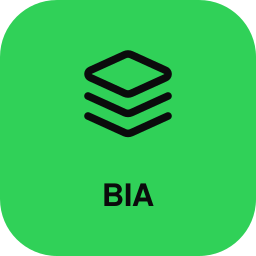
        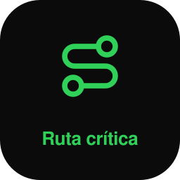
        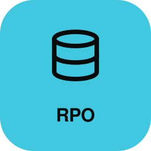
        
        <br>
        <sub><code>impacto 5 × 4 · MTPD · ruta crítica · RPO · exposición · 29 reglas</code></sub>
      </td>
    </tr>
    <tr>
      <td valign="top"><code>├─ codigo:</code><br><br>
        
        
        
        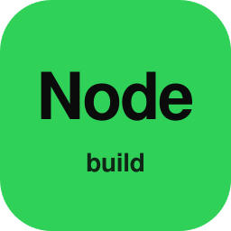<br>
        <sub><code>JavaScript sin dependencias · un HTML autocontenido</code></sub>
      </td>
      <td valign="top"><code>├─ calidad:</code><br><br>
        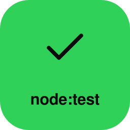
        
        <br>
        <sub><code>node:test 18 · Playwright 102 · axe-core 0 infracciones</code></sub>
      </td>
    </tr>
    <tr>
      <td valign="top"><code>├─ seguridad:</code><br><br>
        
        
        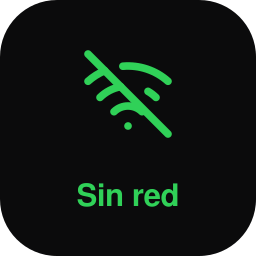<br>
        <sub><code>CSP por hashes · SRI · cero peticiones de red</code></sub>
      </td>
      <td valign="top"><code>╰─ publicacion:</code><br><br>
        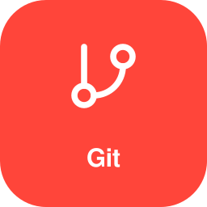
        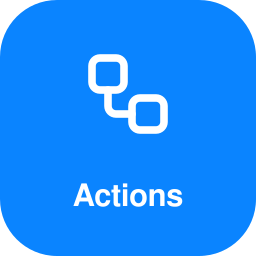
        <br>
        <sub><code>Git · GitHub Actions · GitHub Pages</code></sub>
      </td>
    </tr>
  </tbody>
  <tfoot>
    <tr>
      <td colspan="2"><code>version: 1.1.0&nbsp;&nbsp;·&nbsp;&nbsp;pruebas: 120 ok&nbsp;&nbsp;·&nbsp;&nbsp;licencia: GPLv2</code></td>
    </tr>
  </tfoot>
</table>

</div>

---

## Índice

- [De la plantilla a KAIROS](#-de-la-plantilla-a-kairos)
- [Cómo se usa](#-cómo-se-usa)
- [Mapa mental](#-mapa-mental)
- [Vistas](#-vistas)
- [Capturas](#-capturas)
- [Método de cálculo](#-método-de-cálculo)
- [Arranque rápido](#-arranque-rápido)
- [Calidad](#-calidad)
- [Seguridad y privacidad](#-seguridad-y-privacidad)
- [Estructura](#-estructura)
- [Limitaciones](#-limitaciones)
- [Licencia](#-licencia)
- [Autor](#-autor)

---

##  De la plantilla a KAIROS

KAIROS nace de la plantilla formativa de BIA y BCP del módulo de Gobierno, Riesgo y Cumplimiento del Máster en Ciberseguridad & IA (Evolve Academy). Conserva su estructura y añade el cálculo que la plantilla deja al criterio de quien la rellena:

| En la plantilla | En KAIROS |
|---|---|
| Impacto por función en una celda | Matriz de **5 horizontes** (1 h, 4 h, 24 h, 72 h, 7 días) **× 4 dimensiones** (operativa, legal, reputación, personas). El impacto no puede bajar con el tiempo. |
| Criticidad elegida a mano | Calculada desde la matriz: alta si es crítica a las 24 h o alta a las 4 h; media si es alta a las 72 h. |
| MTPD declarado | Contrastado con el que admite la matriz (el primer horizonte en «crítico»). Si el declarado es mayor, se avisa (BIA-03). |
| RTO como objetivo | **RTO alcanzable** recorriendo la cadena de dependencias, con lo que marca el ritmo y la exposición en euros. |
| Lista de activos y copias | **Secuencia de recuperación** en orden topológico (Gantt) y **RPO alcanzable** con los activos que guardan datos. |
| «RPO < RTO < MAD» | Se exige RTO < MTPD. El RPO es independiente: mide datos perdidos, no tiempo sin servicio. Una función puede tolerar 24 h parada y ninguna pérdida de datos. |
| Equipo y escalado | Comprueba suplentes, que el umbral de activación llegue antes que el RTO más exigente y que el canal secundario no dependa de los sistemas. |
| Pruebas registradas | RTO y RPO medidos frente a los objetivos, acciones correctivas y calendario de las próximas pruebas. |
| — | **Preauditoría** con 29 reglas y estado de op.cont.1–4 según la categoría del ENS. |

## Ecosistema: continuidad y exposición técnica

KAIROS habla con [CTEM-Nexus](https://heindall92.github.io/ctem-nexus/) mediante el sobre común `yrd-ecosistema` (JSON, versión 1). Todo ocurre en el navegador: los ficheros se descargan y se importan a mano.

| Sentido | Qué viaja | Dónde |
|---|---|---|
| KAIROS → CTEM-Nexus | Sobre `bia`: cada activo con las funciones que lo usan, su RTO, RPO, MTPD, coste por hora y criticidad. CTEM-Nexus fija con él la criticidad de negocio de sus activos. | **Exportar → Ecosistema → BIA para CTEM-Nexus** |
| CTEM-Nexus → KAIROS | Sobre `activos`: por activo, hallazgos abiertos, críticos, altos, explotados activamente (KEV), rutas de ataque, peor hallazgo y **riesgo de interrupción** (alto, medio o bajo). | **Exportar → Ecosistema → Importar exposición de CTEM-Nexus** (o «Importar un proyecto», que reconoce el sobre) |

Con la exposición importada, **Recuperación** marca los activos expuestos y enseña su ficha técnica, y la preauditoría añade **CTM-01** (NC menor) cuando un activo de una función crítica tiene un riesgo de interrupción alto: un ciberataque es entonces el escenario de interrupción más probable y conviene ensayarlo. Los activos se emparejan por identificador; en CTEM-Nexus se etiquetan con `kairos:ID`. El sobre se valida y se sanea (identificadores, límites y enumerados) como cualquier otro fichero, y un sobre de otra herramienta o de otro tipo se rechaza. Ejemplo: [`tests/fixtures/ctem-a-kairos.json`](tests/fixtures/ctem-a-kairos.json).

##  Cómo se usa

El proyecto se recorre en tres fases, las mismas de la navegación:

1. **Analizar.**
   - Funciones de negocio con su impacto en el tiempo, RTO, RPO, MTPD y coste por hora.
   - Dependencias de cada función: activos TIC, otras funciones y proveedores con su plazo comprometido.
2. **Planificar.**
   - Estrategia, tiempo y procedimiento de recuperación de cada activo.
   - Copias de seguridad.
   - Equipo de crisis, activación, comunicación y sitio alternativo.
3. **Verificar.**
   - Pruebas con RTO y RPO medidos.
   - Preauditoría con lista de comprobación y revisión.
   - Entregables: plan de continuidad, informe, Excel, plan de acción y proyecto.

Puedes empezar desde cero con el asistente de tres pasos, importar un proyecto o abrir uno de los tres casos de ejemplo.

##  Mapa mental

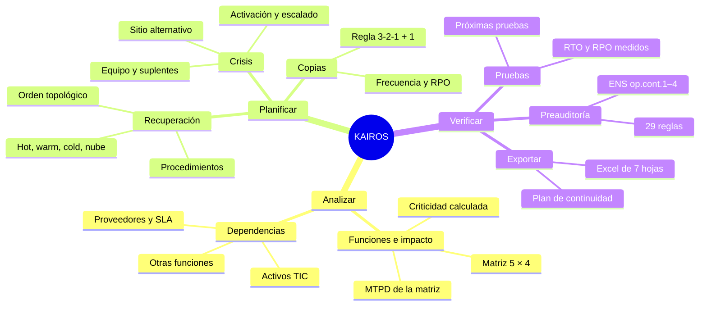

##  Vistas

| Fase | Vista | Qué responde |
|---|---|---|
| — | **Panel** | ¿Cuántas funciones vuelven a tiempo? Reloj de recuperación, RTO y RPO cubiertos, exposición por incidente, lo más urgente y estado de op.cont. |
| Analizar | **Funciones e impacto** | Impacto en el tiempo, criticidad, MTPD y RTO alcanzable de cada función, con quién marca el ritmo. |
| Analizar | **Dependencias** | Mapa de activos, proveedores y funciones; en rojo, lo que llega después del RTO. |
| Planificar | **Recuperación** | Secuencia de recuperación desde el inicio del incidente y procedimiento de cada activo. |
| Planificar | **Copias de seguridad** | Frecuencia frente al RPO, retención, fuera de sede, cifrado, inmutable y última restauración. |
| Planificar | **Gestión de crisis** | Equipo con suplentes, umbral de activación con línea de escalado, comunicación y sitio alternativo. |
| Verificar | **Pruebas** | Ejercicios registrados, resultados frente a objetivos y próximas pruebas. |
| Verificar | **Preauditoría** | Incidencias por severidad con su acción, lista de comprobación y revisión y aprobación. |
| Verificar | **Exportar** | Plan de continuidad, libro Excel, informe, plan de acción y proyecto. |

##  Capturas

<table>
  <tr>
    <td width="50%">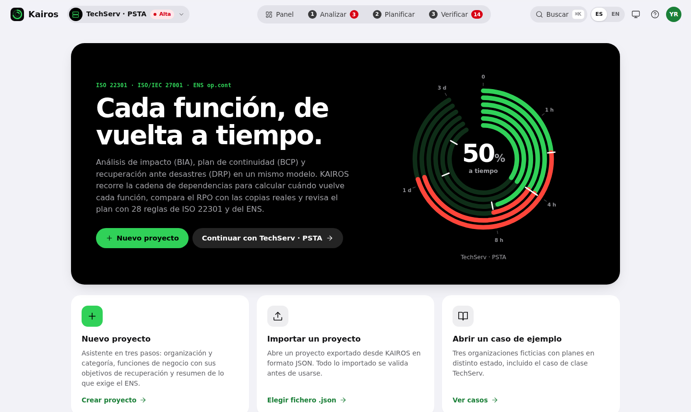<br><sub><b>Inicio.</b> El Reloj de recuperación del proyecto abierto.</sub></td>
    <td width="50%">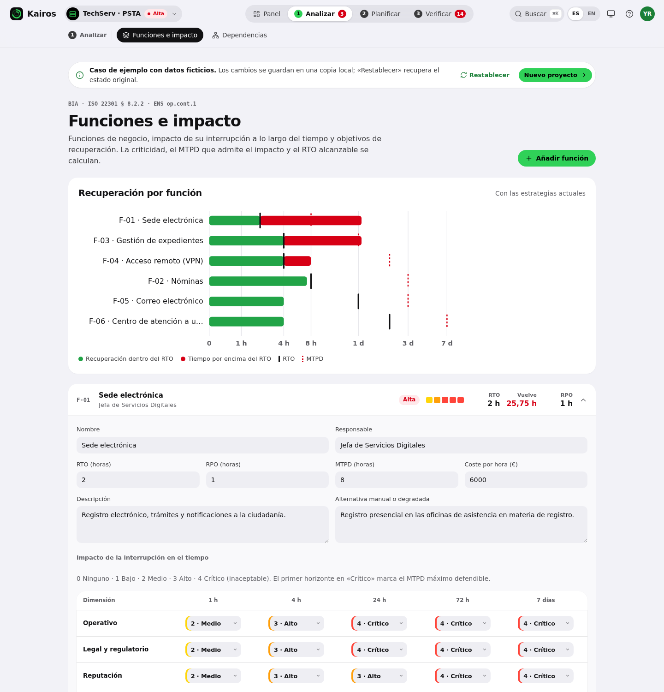<br><sub><b>Funciones e impacto.</b> Matriz 5 × 4, resultado y dependencias de F-01.</sub></td>
  </tr>
  <tr>
    <td>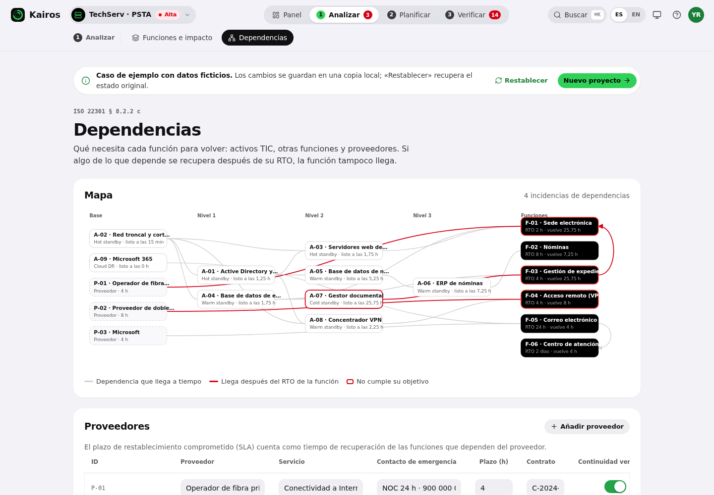<br><sub><b>Dependencias.</b> Lo que llega después del RTO, en rojo.</sub></td>
    <td>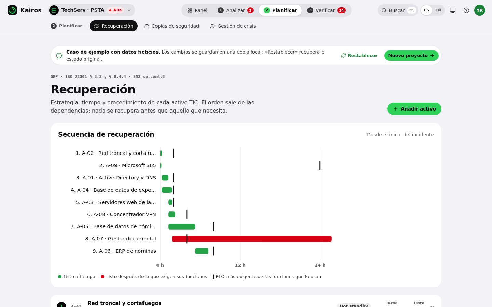<br><sub><b>Recuperación.</b> Gantt desde el inicio del incidente.</sub></td>
  </tr>
  <tr>
    <td>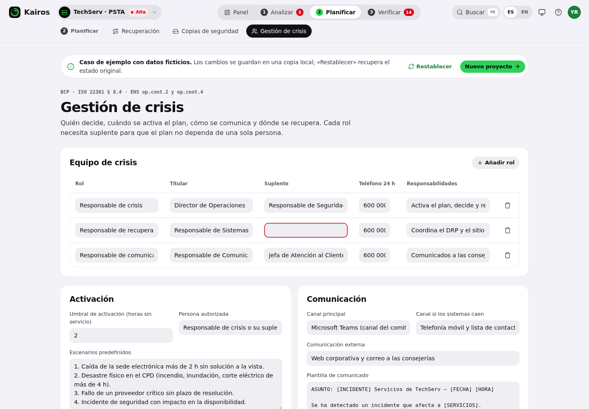<br><sub><b>Gestión de crisis.</b> El plan se activa a tiempo o no.</sub></td>
    <td>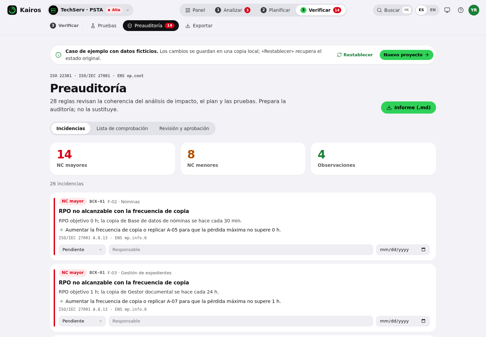<br><sub><b>Preauditoría.</b> 29 reglas, severidad y acción.</sub></td>
  </tr>
  <tr>
    <td>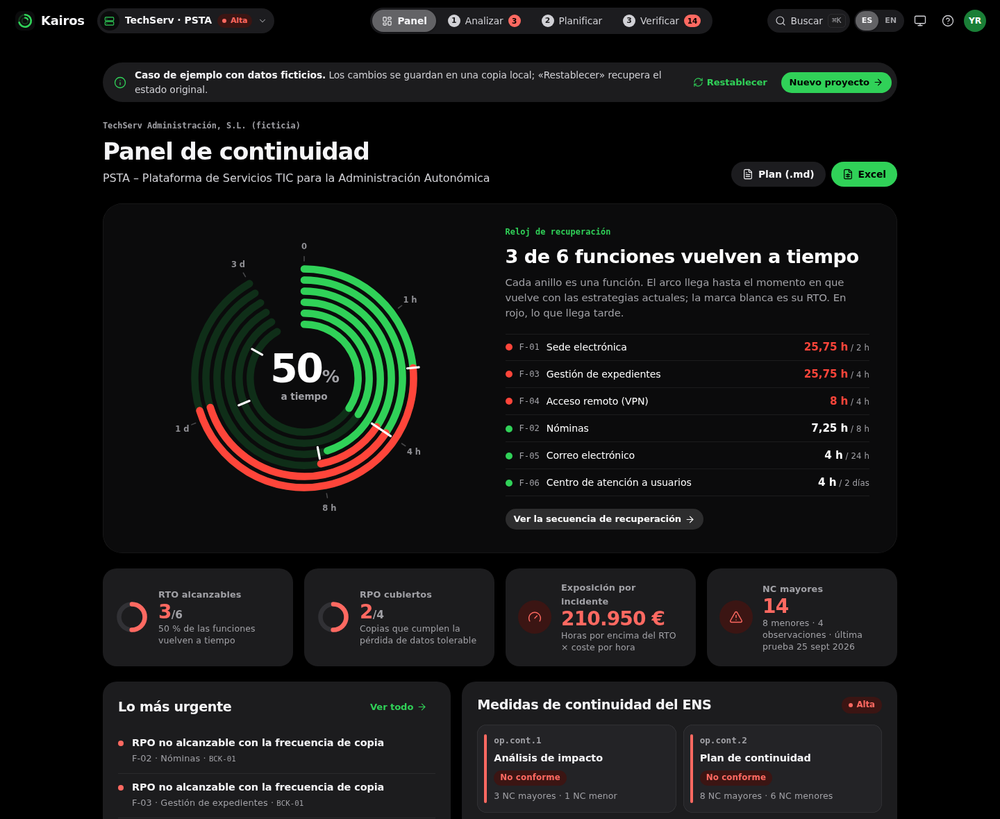<br><sub><b>Tema oscuro.</b> Negro puro y verde eléctrico.</sub></td>
    <td align="center">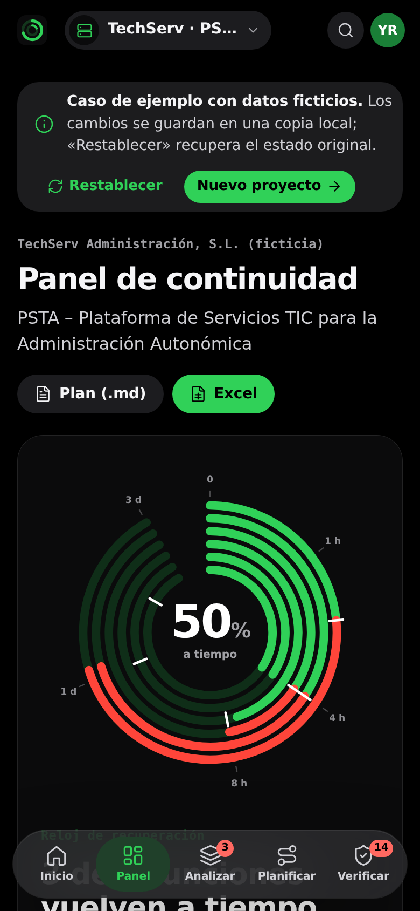<br><sub><b>Móvil.</b> Las fases pasan a una cápsula flotante.</sub></td>
  </tr>
</table>

##  Método de cálculo

**Impacto, criticidad y MTPD.** En cada horizonte se toma el máximo de las cuatro dimensiones y se arrastra hacia delante: el impacto no baja con el tiempo. La criticidad es:
- **alta** si el impacto es crítico (4) a las 24 h o alto (3) a las 4 h;
- **media** si es alto a las 72 h o a las 24 h;
- **baja** en el resto.

El MTPD que admite la matriz es el primer horizonte en «crítico».

**Ruta crítica de recuperación.** Los activos se ordenan topológicamente por sus dependencias. Cada uno empieza cuando terminan aquellos de los que depende y tarda lo que indica su procedimiento o, si no consta, lo típico de su estrategia:

| Estrategia | Tiempo típico |
|---|---|
| Hot standby | 15 min |
| Warm standby | 4 h |
| Nube | 4 h |
| Cold standby | 24 h |
| Sin estrategia | 72 h |

Una función vuelve cuando terminan:
- sus activos;
- las funciones de las que depende, con su propio RTO alcanzable;
- el plazo comprometido por sus proveedores.

El elemento que más tarda **marca el ritmo**: mejorar cualquier otro no adelanta la vuelta. Las dependencias circulares se detectan y se informan (DEP-02).

**RPO alcanzable.** Es la mayor frecuencia de copia entre los activos que guardan datos de la función. Una frecuencia 0 equivale a réplica síncrona. Un activo con datos y sin copia deja el RPO sin cumplir. Las copias de configuración (red, directorio) no cuentan para la pérdida de datos de negocio.

**Exposición económica.** Horas por encima del RTO multiplicadas por el coste por hora de la función, por cada incidente.

**Preauditoría.** 29 reglas en ocho familias:

| Familia | Reglas | Qué revisa |
|---|---|---|
| BIA | 5 | objetivos de recuperación, RTO < MTPD, MTPD frente a la matriz, impacto valorado y responsable |
| DEP | 4 | dependencias más lentas que la función, ciclos, plazos de proveedores y su continuidad verificada |
| DRP | 3 | RTO alcanzable, estrategia y procedimiento |
| BCK | 5 | RPO, restauración probada (30 días en datos de funciones críticas, 90 en el resto), fuera de sede, cifrado e inmutable |
| BCP | 5 | suplentes, activación, comunicación y sitio alternativo |
| TST | 4 | pruebas, resultados, acciones y antigüedad |
| REV | 2 | revisión y aprobación |
| CTM | 1 | activo de una función crítica con riesgo de interrupción alto según CTEM-Nexus (solo si se ha importado su exposición) |

Las reglas generan NC mayores, NC menores u observaciones según la criticidad y la categoría del ENS, que fija qué se exige de op.cont.1 a op.cont.4.

**Lo que encuentra en el caso de clase (TechServ).** La sede electrónica (F-01) tiene un RTO de 2 h y vuelve a las 25,75 h. Depende de la gestión de expedientes (F-03), cuyo gestor documental se restaura en frío en 24 h. Bajar ese activo a 4 h adelanta ambas funciones a 5,75 h y reduce la exposición de 210.950 € a 30.950 € por incidente. La prueba E2E lo comprueba.

##  Arranque rápido

**Usarla.**
- **En el navegador:** abre la [app publicada](https://heindall92.github.io/kairos/dist/index.html).
- **Sin conexión:** descarga `dist/index.html` y ábrelo con doble clic. No necesita instalar nada.

**Desarrollar.**

```bash
git clone https://github.com/heindall92/kairos.git && cd kairos
node app/build.js                 # genera dist/index.html (autónomo) y dist/artifact/kairos.html
node --test tests/engine.test.js  # motor de cálculo
```

**Toda la batería de pruebas.**

```bash
python3 -m venv .venv && source .venv/bin/activate
pip install -r requirements.txt && python -m playwright install chromium
./run_tests.sh                    # build, motor, end-to-end y accesibilidad
```

**Capturas y gráficos del README.** `python3 docs/capturas.py` regenera las capturas y `node docs/assets/generar.js` regenera la cabecera, las cifras y los mosaicos.

##  Calidad

| Suite | Pruebas | Qué comprueba |
|---|---|---|
| Motor (`tests/engine.test.js`) | 18 | Curva de impacto, MTPD y criticidad; ruta crítica, tiempos típicos y ciclos; RTO alcanzable por activos, proveedores y funciones; RPO solo con activos de datos; RTO frente a MTPD; activación del plan; exigencias por categoría del ENS; pruebas; los hallazgos esperados de los tres casos, la integridad de las 29 reglas y el intercambio con CTEM-Nexus (sobre «bia», saneado del sobre «activos» y regla CTM-01). |
| End-to-end (`tests/e2e_app.py`) | 102 | Primera ejecución, las tres fases y nueve vistas, colores de avatar y de acento, enlaces a las siete herramientas GRC, ecosistema con CTEM-Nexus (exportar el BIA, importar la exposición, rechazar sobres ajenos, persistencia y traducción), recálculo en vivo por la cadena de dependencias, impacto y MTPD, copias, crisis, pruebas, preauditoría, asistente, exportaciones (Markdown, CSV, JSON y Excel generado sin red), importación hostil, persistencia, buscador, atajos, inglés, tema, móvil sin desplazamiento horizontal, CSP, XSS, prototype pollution e inyección de fórmulas. |
| Accesibilidad (`tests/a11y_app.py`) | 0 infracciones | axe-core (WCAG 2.2 A/AA) en todas las vistas, los tres casos, filas desplegadas, menús y buscador, en claro y oscuro, a 1440 y 390 px. |

Las pruebas usan una fecha fija: los casos tienen fechas de restauración y de revisión, y el resultado no debe depender del día en que se ejecutan. La [integración continua](.github/workflows/tests.yml) ejecuta todo en cada *push* y comprueba que `dist/` está al día.

##  Seguridad y privacidad

- **Sin peticiones de red.** `dist/index.html` lleva dentro la librería de Excel, inerte hasta que se exporta.
- **CSP por hashes** generada en el build: `default-src 'none'`, `connect-src 'none'`, sin `'unsafe-inline'` para código.
- **Todo lo que entra se valida por esquema**: tipos, rangos, enumeraciones, identificadores e integridad referencial.
- **Prototype pollution**: claves peligrosas eliminadas al parsear, rutas de edición bloqueadas y `Object.prototype` congelado.
- **XSS**: toda salida al DOM pasa por `esc()`.
- **Inyección de fórmulas** neutralizada en CSV y Excel, incluidos espacios iniciales, caracteres invisibles y signos de ancho completo.
- **Markdown seguro** en el plan y el informe: sin HTML, enlaces ni imágenes procedentes de los datos.

El modelo de amenazas completo y cómo informar de una vulnerabilidad están en [SECURITY.md](SECURITY.md).

##  Estructura

```
kairos/
├── 📱 app/
│   ├── build.js                 Ensambla un único HTML con CSP por hashes
│   ├── data/                    Tres casos de ejemplo (ficticios) y su expansión a proyecto
│   ├── src/
│   │   ├── engine.js            Motor: impacto, MTPD, ruta crítica, RPO, exposición, 29 reglas, op.cont
│   │   ├── index.html · styles.css
│   │   └── ui/                  Idioma, núcleo, seguridad, iconos, shell por fases, vistas, E/S y eventos
│   └── vendor/                  xlsx-js-style 1.2.0 (Apache-2.0)
├── 📦 dist/                     index.html (autónomo) · artifact/kairos.html
├── 🧪 tests/                    engine.test.js · e2e_app.py · a11y_app.py · vendor/axe-core
├── 📄 docs/                     Capturas, gráficos del README y sus generadores
└── ⚙️ .github/workflows/        tests.yml
```

##  Limitaciones

- **Es una herramienta de preparación y preauditoría**: no sustituye a la auditoría formal ni al juicio de quien dirige la continuidad.
- **El tiempo típico de cada estrategia es orientativo.** Para un resultado defendible, registra el tiempo de recuperación medido en las pruebas.
- **Las dependencias se suman en serie**: un activo empieza cuando terminan todos los suyos. Las recuperaciones parciales o degradadas se describen en la alternativa manual de cada función, pero no se modelan.
- **Los documentos se generan en español**; la interfaz está en español e inglés.
- **Datos sin cifrar en el `localStorage` del navegador.** Con datos reales, usa la copia descargada en un equipo propio y borra los datos al terminar.

##  Licencia

Distribuido bajo licencia [GPLv2](LICENSE) · © 2026 Yoandy Ramírez Delgado. La exportación a Excel usa [xlsx-js-style](https://github.com/gitbrent/xlsx-js-style) 1.2.0 (Apache-2.0).

Otras herramientas del autor, que comparten el sobre de intercambio `yrd-ecosistema`: [ARGOS](https://github.com/heindall92/argos-grc) (laboratorio de práctica GRC con rutas, máquinas y simulacros), [Rosetta](https://github.com/heindall92/rosetta_multinorma) (15 normas y leyes sobre 152 controles unificados), [ENS Compliance Studio](https://github.com/heindall92/grc_ens_compliance_studio) (categorización, riesgos MAGERIT y Declaración de Aplicabilidad), [CTEM-Nexus](https://github.com/heindall92/ctem-nexus) (exposición técnica y rutas de ataque hacia los activos críticos), [ENS AD Auditor](https://github.com/heindall92/ens_ad-auditor) (Directorio Activo frente al ENS) y [Norvik](https://github.com/heindall92/Norvik_Gobernanza) (gobernanza).

##  Autor

<table>
<tr>
<td align="center" width="100%" valign="top">
<br/>
<b>Yoandy Ramírez Delgado</b><br/>
<sub><b>Diseño y desarrollo de KAIROS</b></sub><br/>
<sub>Junior Pentester · eJPTv2 · AI Governance (ISO 42001) · SysAdmin</sub><br/><br/>
<a href="https://www.linkedin.com/in/yoandyrd92/"></a>
<a href="https://github.com/heindall92"></a>
<a href="https://yoandyramirez.com"></a>
<a href="https://profile.hackthebox.com/profile/019c5812-b4ca-7315-b12f-14db6d2b42fa"></a>
</td>
</tr>
</table>

Errores, reglas discutibles o propuestas: abre una *issue* o escribe a <a href="mailto:yoandyramirezdelgado@gmail.com">yoandyramirezdelgado@gmail.com</a>. Vulnerabilidades: por el proceso de [SECURITY.md](SECURITY.md).

<p align="center">
  
</p>
